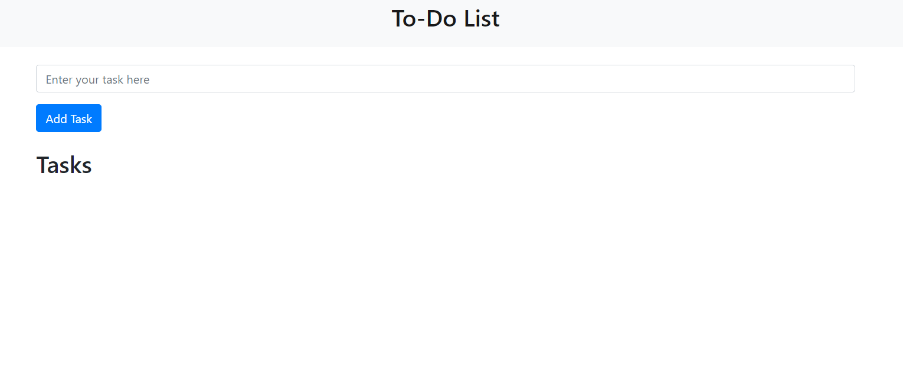

# Flask-To-Do-List
Flask and MongoDB based To-Do List, with create, update, delete features

# 1. Base Page
 

# 2. Adding Task 
 

# 3. Confirmation of task
 

# 4. Updation of task
 

# 5. Completion of task
 

# 5. Deletion of task
 

